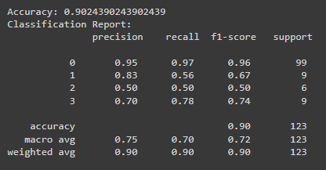

# Hepatitis C Diagnosis Prediction

This project focuses on predicting the diagnosis category of Hepatitis C patients using machine learning techniques. The dataset used for this project includes various clinical features, and the goal is to build a predictive model that can assist in diagnosing Hepatitis C patients.

## Introduction
Hepatitis C is a significant health concern, and predicting its diagnosis category can aid in early detection and treatment planning. This project leverages machine learning, specifically a Gaussian Naive Bayes classifier, to predict the diagnosis category based on various clinical features.

### Dataset 
The dataset used in this project contains information about patients, including their age, sex, and several clinical measurements. The dataset is available in the file HepatitisCdata.csv

It is dowloaded from kaggle and the link for same is provided below.

https://www.kaggle.com/datasets/fedesoriano/hepatitis-c-dataset

### Data Preprocessing
The data preprocessing steps include handling missing values, label encoding categorical variables, addressing imbalances, and log-transforming features with significant outliers.

### Exploratory Data Analysis (EDA)
Exploratory Data Analysis involves understanding the distribution of diagnosis categories, identifying correlations between features, and visualizing key insights from the dataset.

### Model Training
A Gaussian Naive Bayes classifier is employed for predicting the diagnosis category. The model is trained on 80% of data points obtained from preprocessed dataset.

### Evaluation
The model's performance is evaluated using accuracy, precision, recall, and F1-score. The classification report provides detailed insights into the model's effectiveness.

### Collab link

https://colab.research.google.com/drive/1voyvYAJMq4uI4Sx71DGg8npNWdoYvZ76?usp=sharing

### Webapp link
https://hepatitis-c-prediction-xflguwu5yvcdrgzyywjhxs.streamlit.app/

